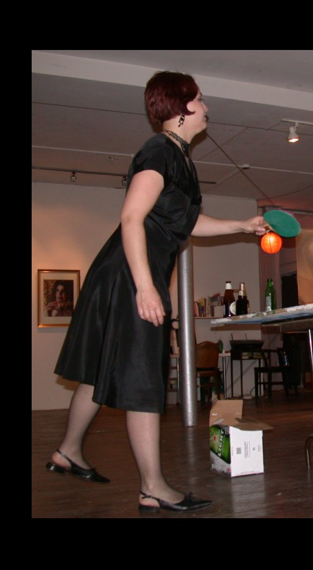

# Directories
1. `directory order`
lsp_dataset

          └images/
          
          └cropped/
          
          └annots.mat

2. `preprocessing.py`: just type `python preprocessing.py`

3. `example`

before cropping and zero padding

after cropping and zero padding
